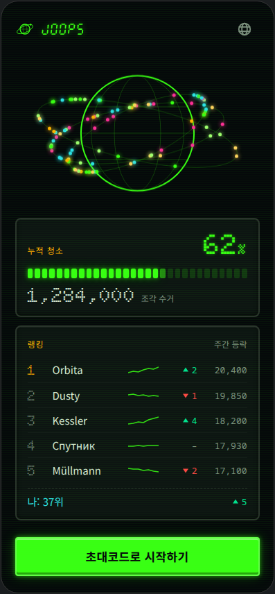

# M1 개발 핸드오프 가이드 — 첫 화면(궤도 대시보드)

> 디자이너 → 개발 핸드오프 문서입니다. [디자인 토큰 v1.0](./design-tokens.md)의 값과 이 문서의 수치만으로 첫 화면([스펙](../product/screens/01-first-screen.md))을 구현할 수 있게 쓰였습니다.
> **완성 시안**: [mockups/first-screen.html](./mockups/first-screen.html) (393×852, Canvas 레퍼런스 구현 포함 — 브라우저로 열어 확인) · [스크린샷](./mockups/first-screen.png)



## 1. 시안 파일 사용법

- `mockups/first-screen.html`은 단순 그림이 아니라 **토큰·수치의 레퍼런스 구현**입니다. 게이지 세그먼트 로직, 스파크라인 좌표 계산, Canvas 렌더 루프(줍스 100기)가 §4~§5 명세 그대로 구현되어 있으니 구현 시 그대로 이식해도 됩니다.
- 시안의 데이터(랭킹 이름·수치)는 더미입니다. 실제 값은 `/api/orbital`([ADR-0005](../architecture/adr/0005-ssr-orbital-api.md))과 랭킹 집계에서 옵니다.

## 2. 디자인 토큰 → `app/globals.css` (복붙 스니펫)

현재 Tailwind v4 설정 파일 없는 방식(`@import "tailwindcss"` + `@theme inline`) 그대로, 아래로 교체하면 됩니다. **다크가 기본값**입니다(라이트는 후순위).

```css
@import "tailwindcss";

:root {
  /* 컬러 — design-tokens.md §1 */
  --color-bg: #05080a;
  --color-surface: #0d1412;
  --color-surface-raised: #141c19;
  --color-fg: #d8e6d4;
  --color-primary: #39ff14;
  --color-primary-dim: #1d7a10;
  --color-secondary: #ffb000;
  --color-secondary-dim: #7a5500;
  --color-accent: #2de2e6;
  --color-accent-magenta: #ff2e97;
  --color-danger: #ff4545;
  --color-success: #00e08f;
  --color-muted: #7d8f7f;
  --color-grid: rgba(57, 255, 20, 0.22);
  --color-grid-strong: rgba(57, 255, 20, 0.40);
  --color-grid-amber: rgba(255, 176, 0, 0.25);
  --color-neutral-050: #f2f7f0; --color-neutral-100: #d8e6d4;
  --color-neutral-200: #aebfab; --color-neutral-300: #8ba08c;
  --color-neutral-400: #7d8f7f; --color-neutral-500: #5c6b5e;
  --color-neutral-600: #414d43; --color-neutral-700: #2a332c;
  --color-neutral-800: #141c19; --color-neutral-900: #0d1412;

  /* 글로우 */
  --glow-primary: 0 0 6px rgba(57,255,20,.55), 0 0 18px rgba(57,255,20,.25);
  --glow-secondary: 0 0 6px rgba(255,176,0,.55), 0 0 18px rgba(255,176,0,.22);
  --glow-accent: 0 0 6px rgba(45,226,230,.55), 0 0 16px rgba(45,226,230,.22);
  --glow-danger: 0 0 6px rgba(255,69,69,.5);
  --glow-text: 0 0 4px rgba(57,255,20,.45);

  /* 타이포 — next/font 변수와 조합(§2-1 메모 참조) */
  --font-display: "DSEG7 Classic", "Doto", "VT323", monospace;
  --font-body: system-ui, "Apple SD Gothic Neo", "Noto Sans KR", "Noto Sans", sans-serif;
  --font-mono: ui-monospace, "SFMono-Regular", "Cascadia Mono", "Noto Sans Mono", monospace;

  /* 간격·레이아웃 */
  --page-pad-x: 20px;
  --content-max: 480px;
  --safe-top: max(env(safe-area-inset-top), 12px);
  --safe-bottom: max(env(safe-area-inset-bottom), 12px);

  /* 반경·베젤 */
  --radius-xs: 2px; --radius-sm: 4px; --radius-md: 8px;
  --bezel-border: 2px;
  --bezel-highlight: rgba(255, 255, 255, 0.06);
  --bezel-shadow: rgba(0, 0, 0, 0.6);

  /* 모션 */
  --motion-fast: 120ms; --motion-base: 200ms; --motion-slow: 400ms;
  --ease-console: cubic-bezier(0.2, 0.8, 0.2, 1);
}

@theme inline {
  --color-bg: var(--color-bg);
  --color-surface: var(--color-surface);
  --color-surface-raised: var(--color-surface-raised);
  --color-fg: var(--color-fg);
  --color-primary: var(--color-primary);
  --color-primary-dim: var(--color-primary-dim);
  --color-secondary: var(--color-secondary);
  --color-accent: var(--color-accent);
  --color-danger: var(--color-danger);
  --color-success: var(--color-success);
  --color-muted: var(--color-muted);
  --font-display: var(--font-display);
  --font-body: var(--font-body);
  --font-mono: var(--font-mono);
}

@media (max-width: 370px) { :root { --page-pad-x: 16px; } }

body {
  background: var(--color-bg);
  color: var(--color-fg);
  font-family: var(--font-body);
  font-size: 15px; line-height: 22px;
}
```

**폰트 로딩 메모**: Doto·VT323은 `next/font/google`로(라틴 서브셋), DSEG7은 도입 시 `next/font/local`(숫자·기호만 든 woff2 ≈ 10–20KB, [keshikan/DSEG](https://github.com/keshikan/DSEG), SIL OFL). `next/font`가 만들어주는 CSS 변수를 `--font-display` 체인 맨 앞에 끼우면 됩니다. display 폰트는 **숫자·라틴 전용** — 한글·키릴 라벨에 쓰지 않기(자동 폴백돼도 미감이 깨짐).

## 3. PWA 스니펫 (ADR-0002 준수)

### 3-1. `app/manifest.ts`

```ts
import type { MetadataRoute } from 'next'

export default function manifest(): MetadataRoute.Manifest {
  return {
    name: '줍스 — 다 함께 우주 청소',
    short_name: '줍스',
    description: '지구 궤도의 우주 쓰레기를 청소하는 반려 로봇, 줍스',
    start_url: '/',
    display: 'standalone',
    orientation: 'portrait',
    background_color: '#05080a', // = --color-bg (단일 출처)
    theme_color: '#05080a',
    icons: [
      { src: '/icon-192.png', sizes: '192x192', type: 'image/png' },
      { src: '/icon-512.png', sizes: '512x512', type: 'image/png' },
      { src: '/icon-maskable-512.png', sizes: '512x512', type: 'image/png', purpose: 'maskable' },
    ],
  }
}
```

### 3-2. 루트 레이아웃 `viewport` + `appleWebApp`

```ts
import type { Metadata, Viewport } from 'next'

export const viewport: Viewport = {
  width: 'device-width',
  initialScale: 1,
  maximumScale: 1,
  userScalable: false,        // 게임 중 핀치줌 차단
  viewportFit: 'cover',       // env(safe-area-inset-*) 활성화에 필수
  themeColor: '#05080a',
  colorScheme: 'dark',
}

export const metadata: Metadata = {
  title: '줍스',
  appleWebApp: {
    capable: true,
    title: '줍스',
    statusBarStyle: 'black-translucent',
    startupImage: [
      { url: '/brand/splash-1179x2556.png', media: '(device-width: 393px) and (device-height: 852px) and (-webkit-device-pixel-ratio: 3) and (orientation: portrait)' },
      { url: '/brand/splash-1206x2622.png', media: '(device-width: 402px) and (device-height: 874px) and (-webkit-device-pixel-ratio: 3) and (orientation: portrait)' },
      { url: '/brand/splash-1290x2796.png', media: '(device-width: 430px) and (device-height: 932px) and (-webkit-device-pixel-ratio: 3) and (orientation: portrait)' },
      { url: '/brand/splash-1320x2868.png', media: '(device-width: 440px) and (device-height: 956px) and (-webkit-device-pixel-ratio: 3) and (orientation: portrait)' },
      { url: '/brand/splash-1170x2532.png', media: '(device-width: 390px) and (device-height: 844px) and (-webkit-device-pixel-ratio: 3) and (orientation: portrait)' },
    ],
  },
}
```

- iOS 스플래시는 **기기 해상도와 정확히 일치할 때만** 적용됩니다(불일치 시 무시). Android는 매니페스트 아이콘+색으로 자동 생성 — 파일 불필요.
- 아이콘 파일 기반 API: `app/favicon.ico`(16+32) · `app/icon.png`(512) · `app/apple-icon.png`(180)은 이미 배치되어 있어 자동으로 `<link>`가 생성됩니다.

## 4. Canvas 2D 수치 명세 (지구본·궤도·줍스)

> 시안의 `<script>` 마지막 블록이 이 명세의 레퍼런스 구현입니다. 토큰은 `getComputedStyle`로 읽어 **하드코딩 금지**([ADR-0003](../architecture/adr/0003-rendering-canvas2d.md)).

| 항목 | 값 |
|---|---|
| 영역 | 상단바·패널을 제외한 **남는 세로 공간을 흡수**(flex), 최소 240px. 393×852 기준 ≈ 250~260px |
| DPR | `min(devicePixelRatio, 2)` 캡(성능) |
| 지구 반경 R | `min(canvasW, canvasH) × 0.34`, 중심 = 캔버스 중앙 |
| 지구 외곽선 | `--color-primary`, 2px |
| 지구 채움 | 없음(배경 투과). 필요 시 `#071a0d` |
| 경선(자오선) | 타원 2개: rx = `R×0.41`, `R×0.82`, ry = R. `--color-grid`, 1px |
| 위선 | 적도(y=0) + 위도 `±0.46R`. 현 길이 = `√(1−dy²)×R`(원 안쪽만). `--color-grid`, 1px |
| 궤도 링 3개 | 반장축 `R×{1.32, 1.55, 1.80}` · 눌림비(ry/rx) `{0.34, 0.30, 0.26}` · 기울기 `{−24°, −10°, +12°}` · `--color-grid`, 1px |
| 줍스 점 | 반지름 **2.5px**, 채움 = API의 `joops[].color` · 글로우 `shadowBlur 6`(같은 색) · **anchor = 점 중심** |
| 링 배분 | 100기 = 40 / 33 / 27 (안→밖) |
| 각속도 | 0.05~0.12 rad/s, 방향 혼합(±) — 실제로는 `lib/orbit.ts` 보간 결과를 사용 |
| 색 팔레트 | 시드 데이터 색상 권장 6종: `#39ff14` `#ffb000` `#2de2e6` `#ff2e97` `#a0ff70` `#ffd25e` |
| 루프 | `requestAnimationFrame`, 화면 미표시 시 정지 |
| reduced-motion | 1프레임 정지 스냅샷만 렌더(시안 구현 참조) |

궤도 위 점 좌표(시안 구현과 동일):

```
rx = R×k;  ry = rx×squash;  t = tilt(rad)
x0 = cos(a)×rx;  y0 = sin(a)×ry
x = cx + x0×cos(t) − y0×sin(t)
y = cy + x0×sin(t) + y0×cos(t)
```

## 5. 화면 해부도 · 컴포넌트 스펙

세로 1열, 위→아래. 기준 393×852 / 최소 360 폭. 좌우 여백 `--page-pad-x`(20px, 360폭에선 16px). 콘텐츠 최대폭 480px(초과 시 중앙 정렬).

### 5-1. 상단 바
- 높이 `56px + --safe-top`, 하단 패딩 없음.
- 좌: 심볼 28px(`logo-symbol.svg`) + 워드마크 높이 18px(`logo-wordmark.svg`), 간격 10px, 색 `--color-primary`, 워드마크에 `drop-shadow(0 0 4px rgba(57,255,20,.45))`.
- 우: 언어 버튼 — 히트영역 **44×44**, 아이콘 22px(`icon-language.svg`), 기본색 `--color-muted`, 활성 `--color-primary`.

### 5-2. 패널 공통(베젤)
```css
background: var(--color-surface);
border: 2px solid var(--color-neutral-700);
border-radius: 8px;
box-shadow: inset 0 1px 0 var(--bezel-highlight), inset 0 -2px 6px var(--bezel-shadow);
padding: 14px 16px;  margin: 0 var(--page-pad-x) 12px;
```
- 패널 라벨(좌상단): 12/16, letter-spacing .08em, 대문자, `--color-secondary`.

### 5-3. 누적 청소 게이지
- 1행: 라벨 "누적 청소" ↔ `62%` — display 폰트 40/44 wght 900, `--color-primary` + `--glow-text`(% 기호는 20px).
- 게이지 바: **세그먼트 30칸**, 높이 14px, 간격 3px, 반경 2px.
  - 점등: `--color-primary` + `--glow-primary` / 부분 점등(잔여 ≥ 0.3칸): 50% 불투명 / 소등: `--color-primary-dim` 35% 불투명.
- 3행: `1,284,000` display 28/32 `--color-fg` + "조각 수거" 12px `--color-muted`.
- 값 갱신 모션: 카운트업 400ms(`--motion-slow`), reduced-motion 시 즉시 표시.

### 5-4. 랭킹
- 행 그리드: `28px | 1fr | 44px | 48px | 64px` (순위 | 이름 | 스파크라인 | 등락 | 수거량), 행 높이 ≥ 36px, 행 구분선 1px `--color-neutral-800`.
- 순위: display 20/24 `--color-muted`, **1위만 `--color-secondary`**.
- 이름: body 15px, 넘치면 말줄임(ellipsis) — 다국어 대응.
- 스파크라인: 44×16, 7포인트 폴리라인 1.5px `--color-primary` 85% 불투명, 채움 없음. y = 15 − v(v: 0~15 정규화).
- 등락: `arrow-up.svg`/`arrow-down.svg` 12px + 수치(mono 13px). 상승 `--color-success` · 하락 `--color-danger` · 보합 `–` `--color-muted`.
- 내 랭킹(로그인 시): 상단 점선 1px `--color-neutral-700` 구분, 텍스트 `--color-accent` 15px.

### 5-5. CTA "초대코드로 시작하기" (물리 버튼)
```css
min-height: 56px;  width: 100%;
font: 600 17px/24px var(--font-body);
color: #05080a;  background: var(--color-primary);
border: 2px solid #63ff47;  border-radius: 4px;
box-shadow: inset 0 2px 0 rgba(255,255,255,.35), inset 0 -3px 0 rgba(0,0,0,.35),
            0 0 6px rgba(57,255,20,.55), 0 0 18px rgba(57,255,20,.25);
```
- **눌림(:active)**: `translateY(1px)` + 섀도 축소(시안 참조), 120ms `--ease-console`.
- **비활성**: 배경 `--color-primary-dim`, 텍스트 `rgba(5,8,10,.7)`, 글로우 제거.
- 하단 여백: `12px + --safe-bottom`.
- 형광 배경 위 텍스트는 **반드시 `#05080a`**(흰색 금지 — 대비 붕괴).

### 5-6. 스캔라인 오버레이
```css
background: repeating-linear-gradient(0deg, rgba(57,255,20,.05) 0 1px, transparent 1px 3px);
```
- 화면 전체 `::after` 1장, `pointer-events: none`, **불투명도 ≤ 0.06**. 움직이지 않는 정적 텍스처(플리커 반복 금지).

### 5-7. 로딩/스켈레톤·빈 상태
- 스켈레톤: `--color-neutral-800` 블록 + 1.2s 펄스(불투명도 .5↔.8). reduced-motion 시 펄스 없이 고정.
- 궤도 데이터 실패 시: 지구+그리드만 정적 렌더 + "신호 대기 중…" caption(`--color-muted`).

## 6. i18n 검수 규칙 (10개 언어)

- 버튼·라벨은 **가변 폭 + 줄바꿈 허용**(CTA는 min-height 56, 2줄까지). 고정폭 잘림 금지, 이름류는 말줄임.
- 최장 텍스트 검수 문자열(시안에 러시아어·독일어 이름 포함됨):
  - CTA 독일어: `Mit Einladungscode starten` / 러시아어: `Начать с кодом приглашения`
  - 라벨 러시아어: `Еженедельное изменение`(주간 등락)
- display 폰트(세그먼트)는 숫자·라틴 전용 → 번역 라벨은 body 폰트로 렌더됨을 전제로 배치.
- 숫자 포맷: `1,284,000`은 로케일 포맷(`Intl.NumberFormat`) — 콤마/마침표/공백 구분 모두 62% 폭 안에서 수용됨(display-md 기준 최대 9자).

## 7. 에셋 인덱스

| 파일 | 용도 | 비고 |
|---|---|---|
| `public/brand/logo-symbol.svg` | 상단 바 심볼(28px) | currentColor |
| `public/brand/logo-wordmark.svg` | 상단 바 워드마크(h18) | currentColor, 세븐세그 레터폼 |
| `public/brand/logo-wordmark-glow.svg` | 마케팅·스플래시류 대형 사용 | 자체 발광(필터 포함) — **래스터 파이프라인 입력 금지** |
| `public/ui/icon-language.svg` | 언어 선택(22px) | currentColor |
| `public/ui/arrow-up.svg` / `arrow-down.svg` | 랭킹 등락(12px) | currentColor(success/danger로 착색) |
| `public/ui/icon-settings.svg` `icon-close.svg` `icon-back.svg` `icon-share.svg` | 공통 아이콘 세트(M2+) | 24 그리드 통일 |
| `public/icon-192.png` `icon-512.png` `icon-maskable-512.png` | 매니페스트 아이콘 | maskable은 안전영역(중앙 원 r40%) 준수 |
| `app/favicon.ico` `app/icon.png` `app/apple-icon.png` | 파일 기반 아이콘 API | 자동 `<link>` 생성 |
| `public/brand/splash-*.png` | iOS 스타트업 이미지 5종 | §3-2 media query와 1:1 |
| `public/design-src/**` | 편집용 마스터 | 런타임에서 참조 금지 |

## 8. 검수 체크리스트 (브리프 §7 대응)

- [x] 세로 360~430 폭에서 잘림·겹침 없음(시안 393/360 스크린샷 검증), safe area 패딩 토큰화
- [x] 다크 기본, 형광 위 텍스트는 `#05080a`(대비 14.8:1), muted ≥ 4.5:1
- [x] 다국어 최장 텍스트 규칙 명시(§6), 시안에 키릴·움라우트 포함
- [x] 첫 화면 모든 요소가 [에셋 인벤토리](./asset-inventory.md) 항목과 대응
- [x] PWA 아이콘 4종 + 파비콘 + maskable 안전영역 검증
- [x] reduced-motion 시 정지 스냅샷(시안 구현 포함)
- [x] 네이밍·폴더·포맷 [README 규칙](./README.md) 준수(전 파일 kebab-case, UI PNG ≤ 200KB)

## 부록 A. 에셋 재생성 방법

마스터 SVG 수정 후 아래 스크립트로 전체 산출물을 재생성합니다(레포 밖 임시 폴더에서 실행 — 레포에 `node_modules`를 만들지 않기).

```bash
mkdir -p /tmp/joops-assetgen && cd /tmp/joops-assetgen
npm init -y && npm i sharp png-to-ico
# 아래 generate.mjs 저장 후 (REPO 경로를 자기 환경으로 수정)
node generate.mjs
```

```js
// generate.mjs — 마스터 SVG → PWA 아이콘 PNG + favicon.ico + iOS 스플래시
// 주의: 마스터 SVG에는 <text>·filter 금지(librsvg), currentColor SVG는 입력 금지(검정 렌더됨)
import sharp from 'sharp';
import pngToIco from 'png-to-ico';
import { writeFileSync, mkdirSync, statSync } from 'node:fs';
import { dirname, join } from 'node:path';

const REPO = '/path/to/joop-03'; // ← 수정
const SRC = join(REPO, 'public/design-src');

async function renderSvgFile(svgPath, outPath, target, intrinsic) {
  const density = (72 * target) / intrinsic; // 벡터를 목표 해상도로 직접 래스터(업스케일 금지)
  mkdirSync(dirname(outPath), { recursive: true });
  await sharp(svgPath, { density }).resize(target, target)
    .png({ compressionLevel: 9 }).toFile(outPath);
}

const ICON = join(SRC, 'icons/icon-master.svg');          // 1024
const MASK = join(SRC, 'icons/icon-maskable-master.svg'); // 1024, 콘텐츠는 중앙 원 r40% 안
const FAV  = join(SRC, 'icons/favicon-master.svg');       // 16 그리드

await renderSvgFile(ICON, join(REPO, 'public/icon-512.png'), 512, 1024);
await renderSvgFile(ICON, join(REPO, 'public/icon-192.png'), 192, 1024);
await renderSvgFile(ICON, join(REPO, 'app/icon.png'), 512, 1024);
await renderSvgFile(ICON, join(REPO, 'app/apple-icon.png'), 180, 1024);
await renderSvgFile(MASK, join(REPO, 'public/icon-maskable-512.png'), 512, 1024);

await renderSvgFile(FAV, 'favicon-16.png', 16, 16);
await renderSvgFile(FAV, 'favicon-32.png', 32, 16);
writeFileSync(join(REPO, 'app/favicon.ico'), await pngToIco(['favicon-16.png', 'favicon-32.png']));

// 스플래시: public/design-src/brand/splash-template.svg 를 기준으로,
// 각 사이즈에 맞춰 SVG 문자열의 width/height/배치를 재계산해 재렌더(리사이즈 금지).
// 전체 구현은 워크로그(2026-07-26) 참조. 사이즈 세트:
// 1179x2556 · 1206x2622 · 1290x2796 · 1320x2868 · 1170x2532
```

> 검증: `file app/favicon.ico` → "2 icons, 16x16, 32x32" · PNG 실측 사이즈 확인 · UI 래스터 ≤ 200KB / 스플래시 ≤ 500KB.
