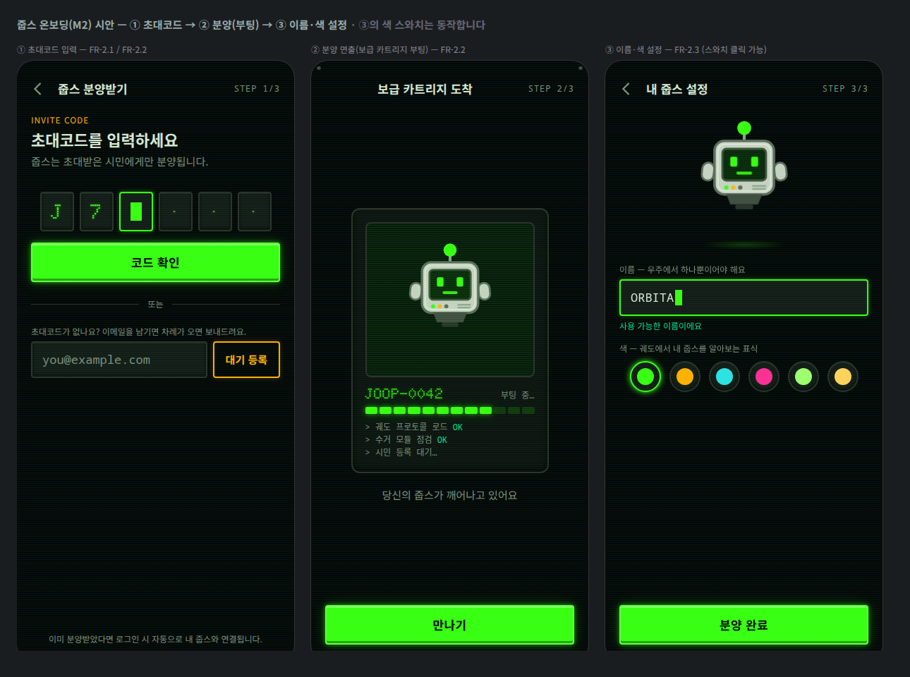

# M2 개발 핸드오프 가이드 — 온보딩(분양) + 줍스 캐릭터

> [디자인 토큰 v1.0](./design-tokens.md)과 [M1 핸드오프](./handoff-m1.md)의 공통 규칙(패널·CTA·safe-area·스캔라인) 위에, M2 온보딩([EPIC 2](../product/requirements.md#epic-2--온보딩-분양--둘째-화면), FR-2.1~2.3)과 **줍스 캐릭터 에셋**의 스펙을 담습니다.
> **완성 시안**: [mockups/onboarding.html](./mockups/onboarding.html) — 3단계 시트, **③의 색 스와치는 실제로 동작**(액센트 교체 인터랙션 레퍼런스). · [스크린샷](./mockups/onboarding.png)



## 1. 화면 플로우

```
첫 화면 CTA "초대코드로 시작하기"
   └─▶ ① 초대코드 입력 ── 코드 유효 ──▶ ② 분양(부팅) 연출 ──▶ ③ 이름·색 설정 ──▶ 완료(내 줍스 연결)
          │                                                            이름 중복 시 ③에 머묾
          └─ 코드 없음: 이메일 대기 등록 → 완료 토스트 → 첫 화면 복귀
```

- ①은 뒤로가기 허용(첫 화면으로). ②는 연출 화면 — 뒤로가기 없음, 부팅 완료 시 "만나기" 활성화. ③은 ②로 뒤로가기 허용.
- 상단 바 우측 `STEP n/3` 인디케이터(mono 12, letter-spacing .08em, `--color-muted`).

## 2. 줍스 캐릭터 에셋

### 2-1. 파일

| 파일 | 내용 |
|---|---|
| `public/game/joop-sheet-{green,amber,cyan,magenta,lime,gold}.png` | 색 변형 6종 스프라이트시트 **768×128**(128px 프레임 6개 가로 배열) |
| `public/game/joop-sheet.meta.json` | 프레임·anchor·상태·색 메타(아래 스키마) |
| `public/design-src/game/joop-character-master.svg` | 마스터(그린 · idle-0). 지오메트리 수정은 여기서 시작 |

색 6종은 시드 데이터 권장 팔레트([M1 핸드오프 §4](./handoff-m1.md))와 동일하며, **API `joops[].color`의 값 = 시트 색 이름 매핑**은 meta JSON의 `colors`가 단일 출처입니다.

### 2-2. meta JSON 스키마 (`joop-sheet.meta.json`)

```jsonc
{
  "version": 1,
  "image": "joop-sheet-{color}.png",   // {color} = colors 키
  "colors": { "green": "#39ff14", … },  // 색 이름 → HEX (joops[].color 매칭용)
  "frameSize": [128, 128],
  "anchor": [64, 64],                   // 기하 중심(우주·부유 상태 기준)
  "anchorNote": "지상(미니게임)은 바닥 기준 [64, 93](노즐 하단) 사용",
  "states": {
    "idle":    { "frames": [0, 1], "fps": 2, "loop": true },   // 대기: 눈 깜빡임·미세 하강
    "move":    { "frames": [2, 3], "fps": 8, "loop": true },   // 이동: 기울임 + 분사염 플리커
    "collect": { "frames": [4, 5], "fps": 6, "loop": true }    // 수거: 팔 벌림 + 트랙터 빔 펄스
  },
  "reducedMotion": "idle 프레임 0 고정"
}
```

### 2-3. Canvas 사용 예시

```ts
// meta = joop-sheet.meta.json, img = joop-sheet-green.png
const st = meta.states[state];
const frame = st.frames[Math.floor(t * st.fps) % st.frames.length];
const [fw, fh] = meta.frameSize, [ax, ay] = meta.anchor;
ctx.drawImage(img, frame * fw, 0, fw, fh, x - ax * s, y - ay * s, fw * s, fh * s);
```

- `prefers-reduced-motion`: 상태와 무관하게 **프레임 0(idle)** 고정.
- 표시 배율 s: 온보딩 미리보기 ≈ 1.4(180px), 지상 미니게임 0.75~1, 궤도(첫 화면)에서는 캐릭터 대신 점 마커 유지.
- UI(비 Canvas)에서는 시안처럼 **인라인 SVG + `--joop-accent`**(currentColor)로 쓰면 색 전환이 즉시 반영됩니다(시안 ③ 참조).

### 2-4. 캐릭터 컬러 규칙

- 고정색: 셸 `#c8d2c4` · 셸 라인 `#5c6b5e` · 금속 `#8ba08c` · 스크린 `#071a0d` · 노즐 `#414d43`/`#2a332c` · 보조 LED `#ffb000`.
- **액센트(= 줍스 색)**: 눈·입·안테나 팁·1번 LED·분사염·트랙터 빔. 색 변형 간에는 액센트만 달라집니다.

## 3. 컴포넌트 스펙 (M2 신규)

### 3-1. 초대코드 입력(6칸)
- 셀 **48×56**, 간격 8, `--color-surface-raised` + 2px `--color-neutral-700` 베젤(인셋 하이라이트/섀도), radius 4.
- 글자: display 폰트 28px `--color-primary` + `--glow-text`. 빈 칸은 `·`(`--color-muted`).
- 활성 셀: 보더 `--color-primary` + 외곽 글로우, **블록 캐럿 16×26** 1.1s 점멸(steps) — reduced-motion 시 고정 표시.
- 오류: 전체 셀 보더 `--color-danger` + helper 문구(아래 3-3). 흔들림 애니메이션은 넣지 않음(reduced-motion 논쟁 회피, 색+문구로 충분).
- 입력 UX: 자동 대문자, 붙여넣기 시 6자 분배, 마지막 칸 입력 시 자동 검증.

### 3-2. 텍스트 입력(콘솔 필드)
- 높이 **52**, padding 0 14, `--color-surface-raised` + 2px 베젤, radius 4, mono 17px.
- focus: 보더 `--color-primary` + 글로우, **블록 캐럿 10×22** 점멸.
- helper(12/16, margin-top 6): 성공 `--color-success` / 오류 `--color-danger` / 중립 `--color-muted`.

### 3-3. 상태·문구 (i18n 키 초안)
| 키 | 한국어 기본 |
|---|---|
| `onboarding.invite.title` | 초대코드를 입력하세요 |
| `onboarding.invite.lead` | 줍스는 초대받은 시민에게만 분양됩니다. |
| `onboarding.invite.cta` | 코드 확인 |
| `onboarding.invite.error.invalid` | 유효하지 않은 코드예요. 다시 확인해 주세요. |
| `onboarding.invite.error.used` | 이미 사용된 코드예요. |
| `onboarding.waitlist.label` | 초대코드가 없나요? 이메일을 남기면 차례가 오면 보내드려요. |
| `onboarding.waitlist.cta` | 대기 등록 |
| `onboarding.waitlist.done` | 등록됐어요. 차례가 오면 메일로 알려드릴게요. |
| `onboarding.boot.title` | 보급 카트리지 도착 |
| `onboarding.boot.status` | 부팅 중… |
| `onboarding.boot.lead` | 당신의 줍스가 깨어나고 있어요 |
| `onboarding.boot.cta` | 만나기 |
| `onboarding.setup.title` | 내 줍스 설정 |
| `onboarding.setup.nameLabel` | 이름 — 우주에서 하나뿐이어야 해요 |
| `onboarding.setup.nameOk` | 사용 가능한 이름이에요 |
| `onboarding.setup.nameTaken` | 이미 사용 중인 이름이에요. |
| `onboarding.setup.colorLabel` | 색 — 궤도에서 내 줍스를 알아보는 표식 |
| `onboarding.setup.cta` | 분양 완료 |

독일어/러시아어 최장 검수: `Warteliste beitreten`(대기 등록), `Проверить код`(코드 확인), `Имя уже занято`(이름 중복) — 버튼 가변 폭 + 2줄 허용 규칙은 [M1 §6](./handoff-m1.md)과 동일.

### 3-4. 세컨더리 버튼(앰버 아웃라인)
- min-height **44**, padding 0 16, 투명 배경 + 2px `--color-secondary` 보더, 텍스트 `--color-secondary`, 약한 앰버 글로우. 프라이머리 CTA와 시각 위계 분리(대기 등록·보조 액션 전용).

### 3-5. 보급 카트리지(부팅 연출)
- 패널 폭 **280**, padding 18, radius 12, 코너 **나사 도트 4개**(6px, `#414d43` + 인셋 섀도).
- 내부 스크린: 높이 **220**, `#071a0d` + 2px 베젤, 자체 스캔라인 오버레이. 캐릭터 170px(idle).
- 부팅 바: 12칸 세그먼트(높이 10, 간격 3) — 게이지와 동일 문법([M1 §5-3](./handoff-m1.md)), 3초에 걸쳐 채움.
- 부팅 로그: mono 12/18 `--color-muted`, `OK`만 `--color-success`. 한 줄씩 0.8s 간격 출현.
- 기기명: display 20px `--color-primary`(`JOOP-####` — 분양 시퀀스 번호).
- 연출 완료 → CTA "만나기" 활성화(미완료 시 disabled 스타일). reduced-motion: 바 즉시 100%, 로그 일괄 표시.

### 3-6. 색 스와치
- 버튼 **44×44 원형**(터치 타깃 충족), `--color-surface-raised` + 2px 베젤, 내부 색 원 24px.
- 선택: 보더 = 해당 색 + 외곽 글로우(`0 0 8px`). `role="radiogroup"`/`aria-checked` — 시안 ③의 스크립트가 레퍼런스.
- 색 선택 즉시 미리보기 캐릭터 액센트 반영(`--joop-accent` 교체).

## 4. 검수 체크리스트

- [x] 3단계 모두 393 프레임 기준, CTA·safe-area 규칙은 M1과 동일 토큰 사용
- [x] 캐릭터 상태 3종 × 색 6종 시트 + meta JSON(스프라이트시트+좌표 메타 규칙 준수)
- [x] 터치 타깃 44px(스와치·아이콘 버튼·세컨더리 버튼)
- [x] reduced-motion 대안 명시(캐럿·깜빡임·부팅 연출·시트 프레임)
- [x] 오류·성공 상태 문구와 색 정의(danger/success), i18n 키 초안 제공
- [x] 에셋 용량: 시트 6종 각 16KB, 시안 스크린샷 124KB

## 부록 — 캐릭터 시트 생성 스크립트 전문

마스터 지오메트리 수정 시 아래로 재생성합니다(실행 환경은 [M1 부록 A](./handoff-m1.md)와 동일: 레포 밖에서 `npm i sharp`).

```js
// joop-character.mjs — 프레임 128×128 × 6(idle0,idle1,move0,move1,collect0,collect1) → 시트 768×128 × 6색
import sharp from 'sharp';
import { writeFileSync, mkdirSync } from 'node:fs';
import { join } from 'node:path';

const REPO = '/path/to/joop-03'; // ← 수정
const COLORS = { green:'#39ff14', amber:'#ffb000', cyan:'#2de2e6',
                 magenta:'#ff2e97', lime:'#a0ff70', gold:'#ffd25e' };

function joopSvg(accent, state, frame) {
  const bob = state === 'idle' && frame === 1 ? 2 : 0;
  const blink = state === 'idle' && frame === 1;
  const tilt = state === 'move' ? -6 : 0;
  const armAngle = state === 'collect' ? 38 : state === 'move' ? -14 : 6;
  const mouthOpen = state === 'collect';
  const eyeH = blink ? 2 : state === 'collect' ? 8 : 10;
  const eyeY = blink ? 46 : state === 'collect' ? 42 : 40;
  const flame = state === 'move'
    ? (frame === 0
      ? `<path d="M56 92 Q64 116 72 92 Z" fill="${accent}" opacity=".85"/>
         <path d="M59 92 Q64 106 69 92 Z" fill="#f2f7f0" opacity=".8"/>`
      : `<path d="M55 92 Q64 122 73 92 Z" fill="${accent}" opacity=".7"/>
         <path d="M59 92 Q64 110 69 92 Z" fill="#f2f7f0" opacity=".85"/>`)
    : '';
  const beam = state === 'collect'
    ? `<path d="M52 92 L34 122 H94 L76 92 Z" fill="${accent}" opacity="${frame === 0 ? .07 : .13}"/>
       <path d="M52 92 L34 122 M76 92 L94 122" stroke="${accent}" stroke-width="1.5" stroke-dasharray="3 3" opacity=".6"/>
       <rect x="${frame === 0 ? 58 : 62}" y="${frame === 0 ? 108 : 100}" width="7" height="7" fill="#8ba08c" transform="rotate(${frame === 0 ? 15 : -20} 62 108)"/>`
    : '';
  const mouth = mouthOpen
    ? `<rect x="58" y="53" width="12" height="7" rx="2" fill="${accent}"/>`
    : `<rect x="56" y="55" width="16" height="3" rx="1.5" fill="${accent}" opacity=".9"/>`;
  return `<svg xmlns="http://www.w3.org/2000/svg" width="128" height="128" viewBox="0 0 128 128">
  <defs><radialGradient id="tip"><stop offset="0%" stop-color="${accent}" stop-opacity=".9"/><stop offset="100%" stop-color="${accent}" stop-opacity="0"/></radialGradient></defs>
  <g transform="translate(64 ${64 + bob}) rotate(${tilt}) translate(-64 -64)">
    <path d="M64 24 V13" stroke="#8ba08c" stroke-width="3"/>
    <circle cx="64" cy="11" r="7" fill="url(#tip)"/>
    <circle cx="64" cy="11" r="3.2" fill="${accent}"/>
    <g fill="#c8d2c4" stroke="#5c6b5e" stroke-width="2">
      <rect x="22" y="46" width="12" height="18" rx="6" transform="rotate(${armAngle} 28 50)"/>
      <rect x="94" y="46" width="12" height="18" rx="6" transform="rotate(${-armAngle} 100 50)"/>
    </g>
    <rect x="34" y="24" width="60" height="54" rx="10" fill="#c8d2c4" stroke="#5c6b5e" stroke-width="2.5"/>
    <rect x="37.5" y="27.5" width="53" height="47" rx="7" fill="none" stroke="#f2f7f0" stroke-opacity=".5" stroke-width="1.5"/>
    <rect x="42" y="32" width="44" height="32" rx="4" fill="#071a0d" stroke="#414d43" stroke-width="2"/>
    <rect x="42" y="32" width="44" height="32" rx="4" fill="${accent}" opacity=".07"/>
    <rect x="50" y="${eyeY}" width="7" height="${eyeH}" rx="1.5" fill="${accent}"/>
    <rect x="71" y="${eyeY}" width="7" height="${eyeH}" rx="1.5" fill="${accent}"/>
    ${mouth}
    <circle cx="46" cy="71" r="2.2" fill="${accent}"/>
    <circle cx="53" cy="71" r="2.2" fill="#ffb000" opacity=".85"/>
    <circle cx="60" cy="71" r="2.2" fill="#5c6b5e"/>
    <path d="M72 69.5h14M72 72.5h14" stroke="#8ba08c" stroke-width="1.5"/>
    <path d="M46 78 H82 L78 88 H50 Z" fill="#414d43"/>
    <rect x="55" y="88" width="18" height="5" rx="2" fill="#2a332c"/>
    ${flame}
  </g>
  ${beam}
</svg>`;
}

const FRAMES = [['idle',0],['idle',1],['move',0],['move',1],['collect',0],['collect',1]];
const outDir = join(REPO, 'public/game');
mkdirSync(outDir, { recursive: true });
for (const [name, hex] of Object.entries(COLORS)) {
  const bufs = await Promise.all(FRAMES.map(([s, f]) =>
    sharp(Buffer.from(joopSvg(hex, s, f))).png().toBuffer()));
  await sharp({ create: { width: 768, height: 128, channels: 4, background: { r:0,g:0,b:0,alpha:0 } } })
    .composite(bufs.map((input, i) => ({ input, left: i * 128, top: 0 })))
    .png({ compressionLevel: 9 }).toFile(join(outDir, `joop-sheet-${name}.png`));
}
```
