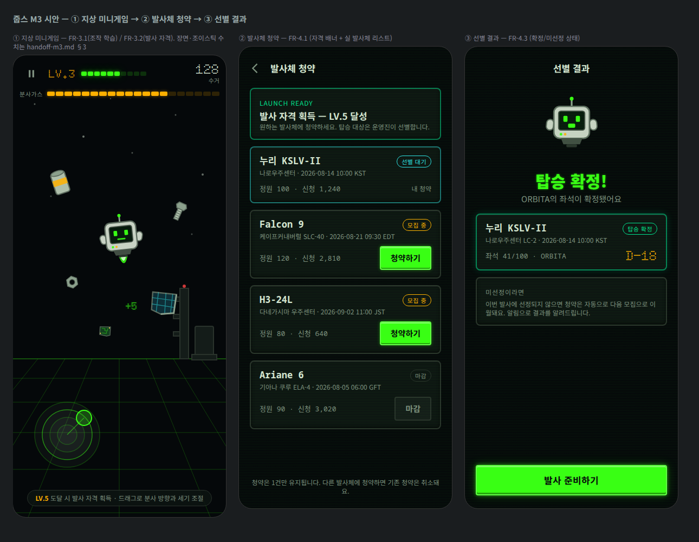

# M3 개발 핸드오프 가이드 — 지상 미니게임 + 발사체 청약

> [토큰 v1.0](./design-tokens.md) · [M1 핸드오프](./handoff-m1.md)(Canvas 공통 규칙) · [M2 핸드오프](./handoff-m2.md)(캐릭터 시트 계약) 위에, M3([EPIC 3·4](../product/requirements.md), FR-3.1~3.2 / FR-4.1~4.3)의 스펙을 담습니다.
> **완성 시안**: [mockups/minigame-subscription.html](./mockups/minigame-subscription.html) · [스크린샷](./mockups/minigame-subscription.png)



## 1. 플로우

```
지상 미니게임(FR-3.1, 조작 학습·수거·레벨업)
   └─ LV.5 도달(FR-3.2) ─▶ 발사체 청약 리스트(FR-4.1) ─▶ 청약(1건 유지)
        └─ 운영진 선별(FR-4.2) ─▶ 선별 결과(FR-4.3): 확정 → M4 발사 시퀀스 / 미선정 → 자동 이월
```

## 2. 우주 쓰레기 스프라이트 계약

| 파일 | 내용 |
|---|---|
| `public/game/debris-sheet.png` | 6종 × 64×64, 시트 **384×64**(12KB) |
| `public/game/debris-sheet.meta.json` | 종별 프레임·값·사이즈 클래스(아래) |
| `public/design-src/game/debris-master.svg` | 마스터(6종 1열, 주석 포함) |

- 종: `can`(음료캔, M/3점) · `bolt`(S/1) · `nut`(S/1) · `panel`(태양전지판 파편, L/5) · `strut`(구조재, M/3) · `chip`(회로기판, S/2).
- **회전은 코드 담당**: 프레임은 종당 1장, 스폰 시 -30~+30 deg/s 랜덤 스핀. anchor = 프레임 중심 [32,32].
- 사이즈 클래스 스케일: S 0.6 · M 0.85 · L 1.1 (기준 64px).
- **수거 피드백**: 수거 순간 해당 줍스 액센트 색 `shadowBlur 8` 글로우 + 120ms 페이드, `+{value}` 점수 팝(display 폰트 18px, `--color-primary` + `--glow-text`, 400ms 상승 후 소멸). reduced-motion: 팝 정지 표시 200ms.
- 아케이드(M5)에서 같은 시트를 재사용합니다(우주 배경에서도 대비 확인 완료 — 외곽선 `#5c6b5e` 2px).

## 3. 5원 반투명 조이스틱 (FR-7.4 선행 스펙 — 지상·아케이드 공용)

터치 지점에 등장하는 **링 4 + 노브 1 = 원 5개** 구성. 시안 ① 좌하단이 시각 레퍼런스.

| 항목 | 값 |
|---|---|
| 링 반지름 | **18 / 32 / 46 / 60** px (분사 1~4단계 경계) |
| 링 스타일 | stroke 1.5px `--color-grid`, 채움 `rgba(216,230,212,.04)` |
| 활성 링 | 현재 분사 단계의 링만 stroke `rgba(57,255,20,.5)` |
| 노브 | r **14**, 채움 `rgba(57,255,20,.25)`, stroke 2px `--color-primary` + `--glow-primary` |
| 방향선 | 중심→노브 1.5px `rgba(57,255,20,.5)` |
| 드래그 | 최대 60px 클램프. **분사량 = 드래그 길이/60**(연속값), 링은 단계 피드백 |
| 등장/소멸 | scale .8→1 + fade 120ms `--ease-console` / 손 떼면 120ms 페이드아웃. reduced-motion: 즉시 |
| 배치 규칙 | 터치 지점 중심. 화면 가장자리 60px 안쪽으로 클램프. 멀티터치 무시(첫 터치 유지) |
| 접근성 | 조이스틱 미조작 시에도 게임 일시정지 버튼은 항상 상단 고정(터치 44px) |

- 물리 연동: 관성 있음·마찰 0(FR-7.5, 관리자 파라미터). 분사 중에만 `분사가스` 소모 — 게이지는 §4.
- 지상 미니게임은 **동일 조작**(FR-7.1의 "지상에서 훈련한 것과 동일")의 훈련장이므로, 여기 정의가 아케이드에도 그대로 적용됩니다.

## 4. 미니게임 화면 명세

### 4-1. 장면(Canvas)
- 배경: `--color-bg` + 별(정적, 첫 화면과 동일 문법). **지평선 y = 화면 높이 × 0.66**.
- 지면: 지평선 아래 원근 그리드 — 수평선 5줄(간격 1.2배씩 증가), 소실점(중앙)으로 수렴하는 사선. 색 `--color-grid`, 지평선만 `--color-grid-strong` 1.5px.
- 발사장 실루엣(우측, 장식): 타워+사다리+건물, `#141c19` 채움 + `#2a332c` 2px 스트로크, 타워 꼭대기 경고등 `--color-danger` r3.
- 캐릭터: `joop-sheet-{색}.png`(내 줍스 색), 지상 배치 anchor [64,93], 배율 0.95. 이동 시 move 상태 + 진행 방향 기울임(시트에 포함).
- 쓰레기: 화면 상단·좌우에서 스폰, 사이즈 클래스별 낙하/부유 속도는 게임 로직 재량(시작값 제안: S 60·M 40·L 25 px/s).

### 4-2. HUD (DOM 오버레이, Canvas 위)
- 상단 1행: 일시정지(44px) · **LV 배지**(display 20 `--color-secondary`) · XP 세그먼트 10칸(높이 8, 게이지 문법) · 우측 수거 카운트(display 24 `--color-fg` + caption).
- 상단 2행: `분사가스` 라벨(11px muted) + **앰버 세그먼트 20칸**(높이 8, 채움 `--color-secondary` + 앰버 글로우, 빈 칸 `rgba(122,85,0,.35)`). 잔량 20% 이하: 채움을 `--color-danger`로 전환 + 1s 펄스(reduced-motion: 색만).
- 하단 목표 배너: 알약형(`rgba(13,20,18,.85)` + 1px 베젤), caption 12px — `LV.5 도달 시 발사 자격 획득`. 최초 30초는 조작 힌트 병기.
- 게임오버(분사가스 소진, FR-7.6 문법 공유): 중앙 패널 "분사가스 소진" + 수거 요약 + [다시 하기] CTA.

## 5. 발사체 청약 화면 명세

- **자격 배너**: 패널 변형 `banner-ok`(보더 `rgba(0,224,143,.5)`), 라벨 `LAUNCH READY`(`--color-success`), 제목 17/24 600. 미자격 시: 기본 패널 + "LV.5부터 청약할 수 있어요" + XP 진행 바.
- **발사체 카드**(패널 재사용):
  - 이름: mono 700 17px / 부제(발사장·일시): caption 12 muted / 정원·신청: mono 13 muted.
  - 상태 칩(알약, 11px, 1.5px 보더): `모집 중`=`--color-secondary` · `마감`=muted · `선별 대기`=`--color-accent` · `탑승 확정`=`--color-success`.
  - 행동: 소형 CTA(min-height 44, primary 물리 버튼) `청약하기` / 마감 시 disabled(`--color-neutral-800` 배경).
  - **내 청약 카드**: 보더 `rgba(45,226,230,.45)` + 우하단 "내 청약" 캡션. 리스트 최상단 고정.
- 규칙 안내(카드 아래 고정): "청약은 1건만 유지됩니다…" caption, 중앙 정렬.
- 발사체명·발사장은 **실 데이터**(FR-4.1)를 그대로 표기(임의 개명 금지), 일시는 현지 시간대 병기.

## 6. 선별 결과 화면 명세

- 히어로: 내 줍스(idle, 140px) + 헤드라인 **body 800 30/38** `--color-primary` + `--glow-text`(한글이므로 display 폰트 금지 — 토큰 규칙) + 서브 캡션.
- 확정 카드: `okcard` — 보더 `rgba(0,224,143,.55)` + 외곽 글로우 `0 0 14px rgba(0,224,143,.18)`, 칩 `탑승 확정`, 좌석 번호 mono, **D-day는 display 24 `--color-secondary`**(숫자라 display 허용).
- 미선정 안내 패널: muted 라벨 + 자동 이월·알림 안내(FR-4.3의 "결과 확인"의 반대 상태를 같은 화면 문법으로).
- CTA `발사 준비하기` → M4 발사 시퀀스 진입.

## 7. i18n 키 초안

| 키 | 한국어 기본 |
|---|---|
| `minigame.hud.collected` | 수거 |
| `minigame.hud.fuel` | 분사가스 |
| `minigame.goal` | LV.{n} 도달 시 발사 자격 획득 |
| `minigame.hint.joystick` | 드래그로 분사 방향과 세기 조절 |
| `minigame.over.title` | 분사가스 소진 |
| `minigame.over.retry` | 다시 하기 |
| `subscription.title` | 발사체 청약 |
| `subscription.ready` | 발사 자격 획득 — LV.{n} 달성 |
| `subscription.locked` | LV.{n}부터 청약할 수 있어요 |
| `subscription.apply` | 청약하기 |
| `subscription.closed` | 마감 |
| `subscription.chip.open` | 모집 중 |
| `subscription.chip.waiting` | 선별 대기 |
| `subscription.chip.confirmed` | 탑승 확정 |
| `subscription.mine` | 내 청약 |
| `subscription.rule` | 청약은 1건만 유지됩니다. 다른 발사체에 청약하면 기존 청약은 취소돼요. |
| `result.confirmed.title` | 탑승 확정! |
| `result.confirmed.sub` | {name}의 좌석이 확정됐어요 |
| `result.notSelected` | 이번 발사에 선정되지 않으면 청약은 자동으로 다음 모집으로 이월돼요. |
| `result.cta` | 발사 준비하기 |

독일어/러시아어 최장 검수: `Startberechtigung erhalten`(발사 자격 획득), `Заявка подана — в ожидании отбора`(선별 대기), 카드 칩·버튼 가변 폭 규칙은 M1 §6 동일.

## 8. 검수 체크리스트

- [x] 쓰레기 6종 시트+메타(외곽선 2px로 우주/지상 양쪽 배경 대비 확보), 회전·수거 피드백 명세
- [x] 조이스틱 5원 수치 명세(반경·색·불투명도·드래그 클램프·등장/소멸·reduced-motion)
- [x] HUD·게이지 문법 M1 재사용(세그먼트 바), 연료 저잔량 상태 정의
- [x] 청약 카드 상태 4종(모집/마감/대기/확정) + 미자격·미선정 상태 정의
- [x] 한글 헤드라인에 display 폰트 미사용(토큰 규칙 준수)
- [x] 용량: debris-sheet 12KB, 시안 스크린샷 164KB

## 부록 — 쓰레기 시트 생성 스크립트

실행 환경·규칙은 [M1 부록 A](./handoff-m1.md)와 동일(레포 밖 `npm i sharp`, 마스터에 텍스트·필터 금지). 종 추가 시 `SPRITES`에 64×64 지오메트리를 추가하고 메타 `types`에 등록하면 됩니다.

```js
// debris-sprites.mjs — 6종 × 64×64 → 시트 384×64 + 메타
// 전체 지오메트리는 public/design-src/game/debris-master.svg 참조(동일 소스)
import sharp from 'sharp';
import { writeFileSync, mkdirSync } from 'node:fs';
import { join } from 'node:path';

const REPO = '/path/to/joop-03'; // ← 수정
const SPRITES = { /* can·bolt·nut·panel·strut·chip — debris-master.svg의 <g> 지오메트리 */ };
const svgWrap = inner => `<svg xmlns="http://www.w3.org/2000/svg" width="64" height="64" viewBox="0 0 64 64">${inner}</svg>`;

const names = Object.keys(SPRITES);
const bufs = await Promise.all(names.map(n => sharp(Buffer.from(svgWrap(SPRITES[n]))).png().toBuffer()));
await sharp({ create: { width: 64 * names.length, height: 64, channels: 4, background: { r:0,g:0,b:0,alpha:0 } } })
  .composite(bufs.map((input, i) => ({ input, left: i * 64, top: 0 })))
  .png({ compressionLevel: 9 }).toFile(join(REPO, 'public/game/debris-sheet.png'));
```
