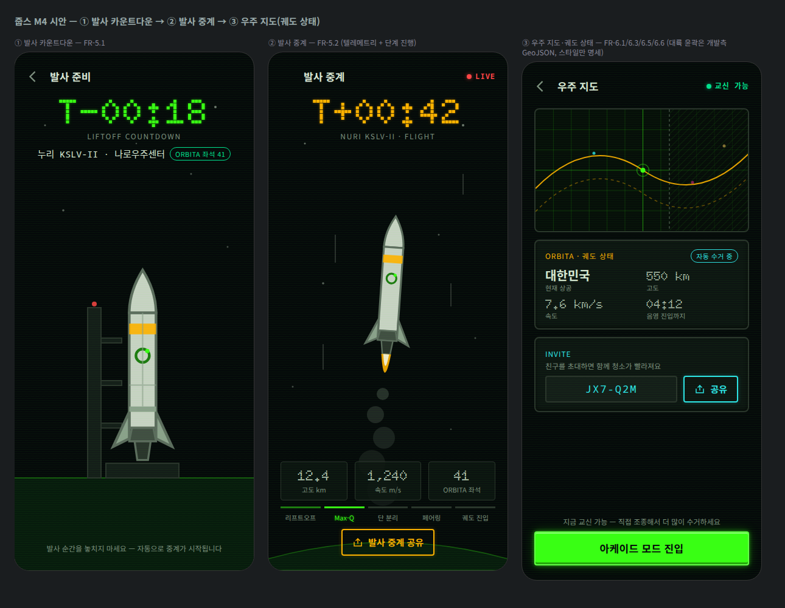

# M4 개발 핸드오프 가이드 — 발사 시퀀스 + 우주 지도

> [토큰 v1.0](./design-tokens.md) · M1~M3 핸드오프의 공통 문법(패널·CTA·게이지·칩) 위에, M4([EPIC 5·6](../product/requirements.md), FR-5.1~5.3 / FR-6.1~6.6)의 스펙을 담습니다.
> **완성 시안**: [mockups/launch-space-map.html](./mockups/launch-space-map.html) · [스크린샷](./mockups/launch-space-map.png)



## 1. 플로우

```
선별 확정(M3) ─▶ ① 카운트다운(FR-5.1) ── T-0 자동 전환 ──▶ ② 발사 중계(FR-5.2)
                                                              └─ 궤도 진입 ─▶ ③ 우주 지도(FR-6.x)
리플레이·공유(FR-5.3, 후속): ②의 공유 버튼 자리만 M4에서 확보
```

## 2. 로켓 에셋

| 파일 | 내용 |
|---|---|
| `public/game/rocket.svg` | 발사체 벡터 **64×160**, anchor 하단 중앙 **[32, 152]**(노즐 끝) |
| `public/design-src/game/rocket-master.svg` | 마스터(주석 포함) |

- 고정 팔레트(캐릭터와 동일 계열): 동체 `#c8d2c4` · 라인 `#5c6b5e` · 금속 `#8ba08c` · 앰버 밴드 `#ffb000` · 엔진 `#414d43`/`#2a332c`. 동체의 궤도 심볼(브랜드 모티프)은 `#1d7a10` 링 + `#39ff14` 점.
- 사용 배율: 카운트다운(발사대) ×2.2 · 중계(비행) ×1.6.
- **화염·연기는 에셋이 아니라 이펙트 레이어**(코드): 화염 = 노즐 아래 2겹 물방울 곡선(외곽 `--color-secondary` .9 / 내부 `#f2f7f0` .85), 프레임마다 길이 ±20% 플리커(8fps). 연기 = 회색(`#8ba08c`) 원, 아래로 갈수록 r 10→26·불투명도 .25→.09. reduced-motion: 화염 고정 길이, 연기 정적.

## 3. 카운트다운 화면 (FR-5.1)

- **T-마이너스 계기**: display **900 56/60** `--color-primary` + `--glow-text`, 형식 `T-MM:SS`(마지막 10초는 `T-0:SS` + 1s 펄스, reduced-motion 시 펄스 없음). 서브 라벨 caption 12, letter-spacing .14em, muted.
- 미션 행: 발사체·발사장(mono 15) + 좌석 칩(`chip ok`, `--color-success`).
- 장면: 별 + 지면(`#071a0d`, 지평선 `--color-grid-strong`) + 발사대 타워(`#141c19`/`#2a332c`, 꼭대기 경고등 `--color-danger` r4) + 로켓 ×2.2.
- 하단 안내 caption: "발사 순간을 놓치지 마세요 — 자동으로 중계가 시작됩니다". T-0에 ②로 자동 전환. 뒤로가기는 T-60 전까지만 노출.
- 알림(FR-6.6 문법 선행): T-10분·T-1분 웹 푸시는 후속(ADR-0002 오프라인/푸시 마일스톤)과 연동.

## 4. 발사 중계 화면 (FR-5.2)

- 상단: 제목 좌측 + **LIVE 칩**(mono 12 `--color-danger` + r8 점, 1s 점멸 — reduced-motion 시 고정).
- **T-플러스 계기**: T-마이너스와 동일 규격, 색만 `--color-secondary`(앰버 = 진행 중).
- 장면: 상승 로켓(×1.6, 4° 기울임) + 화염·연기(§2) + 속도선(`rgba(216,230,212,.18)` 2px 수직선) + 하단 지구 곡률(`#071a0d` 아치 + `rgba(57,255,20,.3)` 림).
- **텔레메트리 타일 3개**: 반투명 패널(`rgba(13,20,18,.85)` + 1px 베젤), 수치 display 700 22 `--color-fg` + caption 11 muted. 고도(km)·속도(m/s)·내 좌석. 값은 250ms 간격 갱신(카운트업 없이 즉시 — 계기 감성).
- **단계 진행 바**: 리프트오프 → Max-Q → 단 분리 → 페어링 → 궤도 진입. 각 스텝 상단 3px 보더 — 완료 `--color-primary-dim` / 현재 `--color-primary` + 텍스트 글로우 / 미도달 `--color-neutral-700`. caption 11.
- 공유: 세컨더리 버튼(앰버) + `icon-share.svg`. **FR-5.3 리플레이는 후속** — 버튼 액션은 현재 화면 링크 공유까지만.
- 궤도 진입 시: "궤도 진입 성공" 토스트(success) 후 ③으로 전환.

## 5. 우주 지도 화면 (FR-6.1 / 6.3 / 6.5 / 6.6)

### 5-1. 지도(Canvas, equirectangular 2:1 → 표시 353×200)
| 항목 | 값 |
|---|---|
| 투영 | equirectangular(경도 -180~180 → x 0~W, 위도 90~-90 → y 0~H) |
| 그리드 | 30° 간격 1px `rgba(57,255,20,.16)`, 적도·본초자오선 1.2px `--color-grid-strong` |
| 대륙 윤곽 | **개발측 GeoJSON(간략화) 데이터** — 스타일: 채움 없음, 스트로크 1px `rgba(57,255,20,.28)`. 시안은 그리드만(자리 표시) |
| 지상 궤적 | 현재 패스: 2px `--color-secondary` .9 / 다음 패스: 1.5px 대시(5 5) .4 |
| 내 줍스 마커 | 중심점 r4 `--joop-accent`(내 색) + 링 r10 stroke 1.5 `rgba(57,255,20,.4)`, anchor 중심 |
| 다른 줍스 | r2.5, 각자 색, 불투명도 .5(음영 안) ~ .8(교신 가능) |
| **음영(통신 두절) 밴드** | 45° 해치 패턴(8px 주기, `rgba(5,8,10,.55)` + `rgba(57,255,20,.12)` 라인), 경계 1.5px 대시 `rgba(125,143,127,.5)`. 실제 경계는 궤도 계산 결과(FR-6.2 파라미터) |
| 프레임 | 지도는 10초 스냅샷 + 보간(첫 화면과 동일 문법, [ADR-0005](../architecture/adr/0005-ssr-orbital-api.md)) |

### 5-2. 상태 패널 (FR-6.3 · FR-6.4 공유 수치)
- 라벨 행: `ORBITA · 궤도 상태` + 모드 칩 — `자동 수거 중`(accent) / `교신 가능`(success) / `음영`(muted).
- 2×2 계기 그리드: **현재 상공 국가명**(body 계열 20 — 국가명은 다국어 문자라 display 금지) · 고도 km · 속도 km/s · **음영 진입/해제까지 MM:SS**(display). caption 11 muted.
- 상단 바 우측 상태 인디케이터: `교신 가능`(success 점) / `음영`(muted 점). 점멸 없음(상시 표시).

### 5-3. 초대 공유 (FR-6.5)
- 패널: 라벨 `INVITE`(accent), 안내 caption, **코드 박스**(mono 17, letter-spacing .12em, `--color-accent`, surface-raised + 베젤) + 공유 버튼(세컨더리, accent 색 변형). 코드 형식 `XXX-XXX`.
- 탭 시 OS 공유 시트. 피초대자 활동 추적 UI는 EPIC 9(후속) — 이 패널이 진입점.

### 5-4. 아케이드 진입 (FR-6.6)
- 교신 가능 상태: 하단 안내 caption + **프라이머리 CTA "아케이드 모드 진입"**.
- 음영 상태: CTA 비활성(disabled 스타일) + "음영 해제까지 MM:SS 후 조종할 수 있어요".
- 교신 전환 순간 알람(웹 푸시)은 후속 마일스톤 — 화면 내 상태 전환만 M4 범위.

## 6. i18n 키 초안

| 키 | 한국어 기본 |
|---|---|
| `launch.countdown.sub` | LIFTOFF COUNTDOWN |
| `launch.countdown.hint` | 발사 순간을 놓치지 마세요 — 자동으로 중계가 시작됩니다 |
| `launch.live` | LIVE |
| `launch.tele.altitude` | 고도 km |
| `launch.tele.speed` | 속도 m/s |
| `launch.tele.seat` | {name} 좌석 |
| `launch.stage.liftoff` | 리프트오프 |
| `launch.stage.maxq` | Max-Q |
| `launch.stage.separation` | 단 분리 |
| `launch.stage.fairing` | 페어링 |
| `launch.stage.orbit` | 궤도 진입 |
| `launch.share` | 발사 중계 공유 |
| `launch.orbitSuccess` | 궤도 진입 성공 |
| `map.title` | 우주 지도 |
| `map.status.auto` | 자동 수거 중 |
| `map.status.link` | 교신 가능 |
| `map.status.shadow` | 음영 |
| `map.over` | 현재 상공 |
| `map.altitude` | 고도 |
| `map.speed` | 속도 |
| `map.shadowIn` | 음영 진입까지 |
| `map.shadowOut` | 음영 해제까지 |
| `map.invite.lead` | 친구를 초대하면 함께 청소가 빨라져요 |
| `map.invite.share` | 공유 |
| `map.arcade.cta` | 아케이드 모드 진입 |
| `map.arcade.hint` | 지금 교신 가능 — 직접 조종해서 더 많이 수거하세요 |
| `map.arcade.locked` | 음영 해제까지 {mm:ss} 후 조종할 수 있어요 |

독일어/러시아어 최장 검수: `Ins Arkade-Modus wechseln`, `Вход в аркадный режим`, `Приглашение отправлено`.

## 7. 검수 체크리스트

- [x] T-계기: 그린(대기)/앰버(비행) 색 구분, display 폰트는 `T±MM:SS`(라틴·숫자)만
- [x] 국가명 등 다국어 텍스트는 body 폰트(§5-2)
- [x] 지도 수치 명세(그리드·궤적·음영 해치·마커) — 대륙 데이터는 개발측, 스타일만 디자인 소관
- [x] 음영/교신 상태별 CTA·칩·인디케이터 정의(FR-6.1/6.6), 점멸은 LIVE만(reduced-motion 대안 포함)
- [x] 로켓 anchor·배율·화염/연기 이펙트 분리 명세
- [x] 용량: rocket.svg 1.3KB, 시안 스크린샷 152KB
