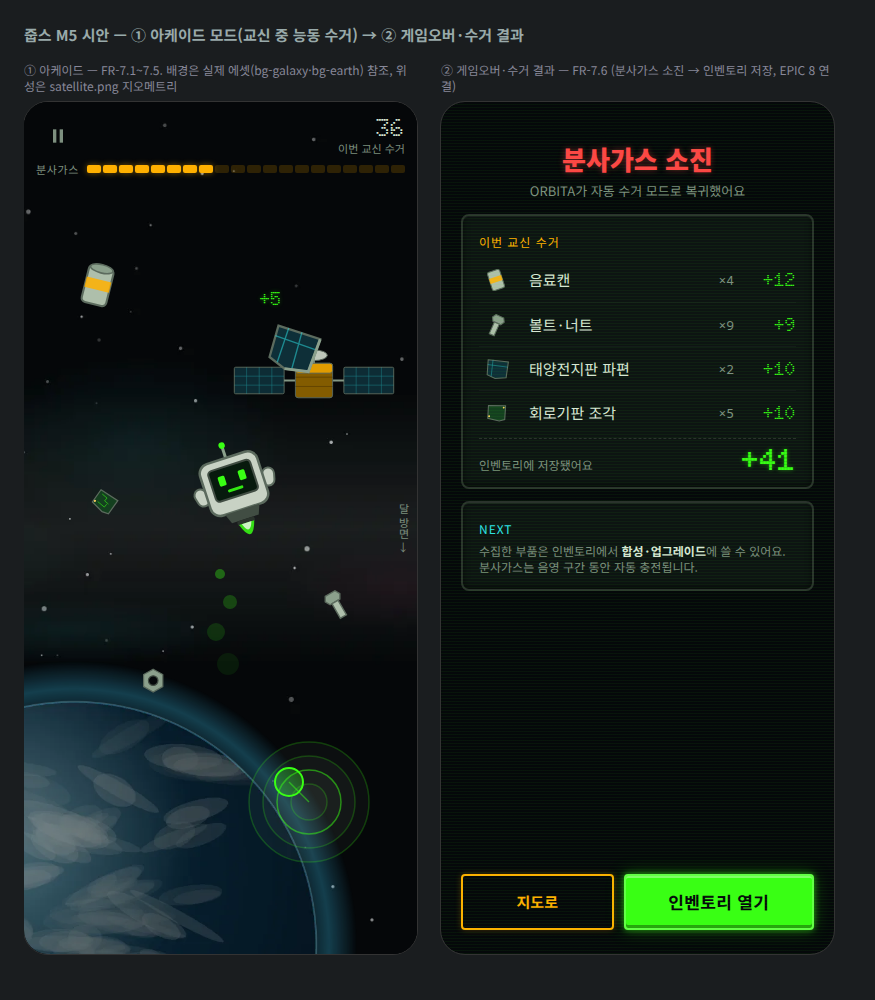

# M5 개발 핸드오프 가이드 — 아케이드 모드

> [토큰 v1.0](./design-tokens.md) · M1~M4 핸드오프 위에, M5([EPIC 7](../product/requirements.md), FR-7.1~7.7)의 스펙을 담습니다. 조이스틱은 [M3 §3](./handoff-m3.md), 쓰레기 시트는 [M3 §2](./handoff-m3.md), 캐릭터 시트는 [M2 §2](./handoff-m2.md)를 그대로 재사용합니다.
> **완성 시안**: [mockups/arcade.html](./mockups/arcade.html) — 실제 배경 에셋을 참조해 실전 조합 검증. · [스크린샷](./mockups/arcade.png)

## 1. 배경 천체 에셋 (FR-7.1 / 7.2)

| 파일 | 규격 | 용도 |
|---|---|---|
| `public/game/bg-galaxy.webp` | **2048×1024, 수평 타일** | 기본 우주 배경(스크롤 시 x 반복) |
| `public/game/bg-earth.webp` | 1024×1024 | 지구 구역 대형 천체 |
| `public/game/bg-moon.webp` | 1024×1024 | 달 구역 |
| `public/game/bg-sun.webp` | 1024×1024 | 태양 구역(발광 포함) |
| `public/design-src/game/bg-*-master.svg` | 벡터 마스터 | 절차 생성 원본 |

- **전부 자체 절차 생성**(NASA 사진 미사용): 라이선스·출처 관리 부담 제거, WebP 총 192KB(사진 대비 1/10 이하), 게임 아트 스타일 일관성. NASA는 무드 레퍼런스로만.
- **레이어·패럴럭스**: `bg-galaxy`(최원경, 스크롤 계수 0.1) → 천체(원경, 0.3) → 위성(중경, 0.6) → 쓰레기·줍스(근경, 1.0). 천체는 화면의 30~60%를 차지하는 대형 오브젝트로 배치(웅장함).
- **구역 전환**(FR-7.2): 경계 통과 시 천체 크로스페이드 800ms + 화면 가장자리 **구역 힌트**(세로쓰기 caption `달 방면 →`, muted). reduced-motion: 즉시 전환.
- 태양 구역: `bg-sun` 인접 시 화면 전체에 앰버 틴트 오버레이 ≤ 8%(뜨거움 연출, 가독성 유지).

## 2. 위성 (FR-7.7 후속 포함)

- `public/game/satellite.png` **512×256**, anchor 중심 [256,128]. 마스터 `satellite-master.svg`.
- **원근 연출**: 스케일 0.15(원경 실루엣) → 2.4(근접 통과)를 궤적에 따라 연속 보간. 근접 시 z-순서를 줍스 위로 올려 "스쳐 지나가는" 압도감. 속도는 스케일에 비례(가까울수록 빠르게).
- 위성은 **장애물이 아니라 배경 오브젝트**(충돌 없음, M5 기준). 사실적 디테일 강화(FR-7.7)는 후속에서 프레임 추가 없이 대형 전용 이미지 검토.

## 3. 분사가스 파티클 (에셋 아님 — 코드 명세)

- 분사 방향 반대편으로 원 배출: 생성 r5 → 소멸 r11, 불투명도 .35 → .08, 수명 600ms, 초당 12개(분사량 비례), 색 = 줍스 액센트.
- 화면당 파티클 상한 60(성능 예산). reduced-motion: 파티클 없이 시트의 분사염 프레임만.

## 4. 아케이드 HUD·규칙 (FR-7.3~7.6)

- HUD 최소주의(장면 몰입 우선): 상단 = 일시정지(44px) + 우측 수거 카운트(display 24 + caption `이번 교신 수거`) / 그 아래 **분사가스 바 20칸**(M3 §4-2와 동일 규격, 저잔량 20% 이하 danger 전환).
- 수거: 쓰레기 접촉 = 수거. 피드백은 [M3 §2](./handoff-m3.md)(액센트 글로우 + `+{value}` 팝) 동일.
- 물리: 관성 있음·마찰 0(FR-7.5) — 조작 감각 파라미터(`추력 가속도`, `최대 속도`)는 `joop_03_game_config` 연동, 기본값은 지상 미니게임과 동일하게 시작해 관리자 튜닝.
- 게임오버(FR-7.6): 분사가스 0 → 조작 잠금 → 800ms 후 결과 화면 전환.
- 교신 시간 제한: 음영 진입 시각이 오면 잔여 분사가스와 무관하게 종료 예고 토스트(60초 전, secondary) 후 종료.

## 5. 게임오버·수거 결과 화면

- 히어로: `분사가스 소진` — body 800 26/34 `--color-danger` + 붉은 글로우(한글이므로 display 금지), 서브 caption.
- **수거 요약 리스트**: 행 그리드 `40px | 1fr | auto | auto`(아이콘 34px = debris 지오메트리 재사용 | 이름 | ×수량 mono | +점수 display 18 primary), 행 높이 ≥ 44, 구분선 neutral-800.
- 합계 행: 점선 구분 + `인벤토리에 저장됐어요` caption + 총점 **display 900 30** + 글로우.
- 안내 패널(EPIC 8 연결): 합성·업그레이드 프리뷰 문구 + "분사가스는 음영 구간 동안 자동 충전".
- CTA 행: `지도로`(세컨더리, flex 1) + `인벤토리 열기`(프라이머리, flex 1.6).

## 6. i18n 키 초안

| 키 | 한국어 기본 |
|---|---|
| `arcade.hud.collected` | 이번 교신 수거 |
| `arcade.hud.fuel` | 분사가스 |
| `arcade.zone.earth` / `.moon` / `.sun` | 지구 방면 / 달 방면 / 태양 방면 |
| `arcade.endSoon` | 곧 음영 구간이에요 — 교신이 {s}초 후 종료됩니다 |
| `arcade.over.title` | 분사가스 소진 |
| `arcade.over.sub` | {name}가 자동 수거 모드로 복귀했어요 |
| `arcade.over.saved` | 인벤토리에 저장됐어요 |
| `arcade.over.next` | 수집한 부품은 인벤토리에서 합성·업그레이드에 쓸 수 있어요. 분사가스는 음영 구간 동안 자동 충전됩니다. |
| `arcade.over.toMap` | 지도로 |
| `arcade.over.toInventory` | 인벤토리 열기 |

## 7. 검수 체크리스트

- [x] 천체 4종 절차 생성(라이선스 клиро), WebP 총 192KB — 배경 예산(≤500KB/장) 내
- [x] 은하수 수평 타일(별·성운 가장자리 40px 회피로 이음새 방지)
- [x] 패럴럭스 4레이어·구역 전환·태양 틴트 규칙 정의
- [x] 위성 원근(0.15~2.4 스케일)·z-순서 규칙, 충돌 없음 명시
- [x] 파티클·시간 제한·게임오버 플로우, 기존 시트(캐릭터·쓰레기)·조이스틱 스펙 재사용 확인
- [x] 시안이 실제 에셋(bg-galaxy·bg-earth)을 로드해 실전 조합 검증
