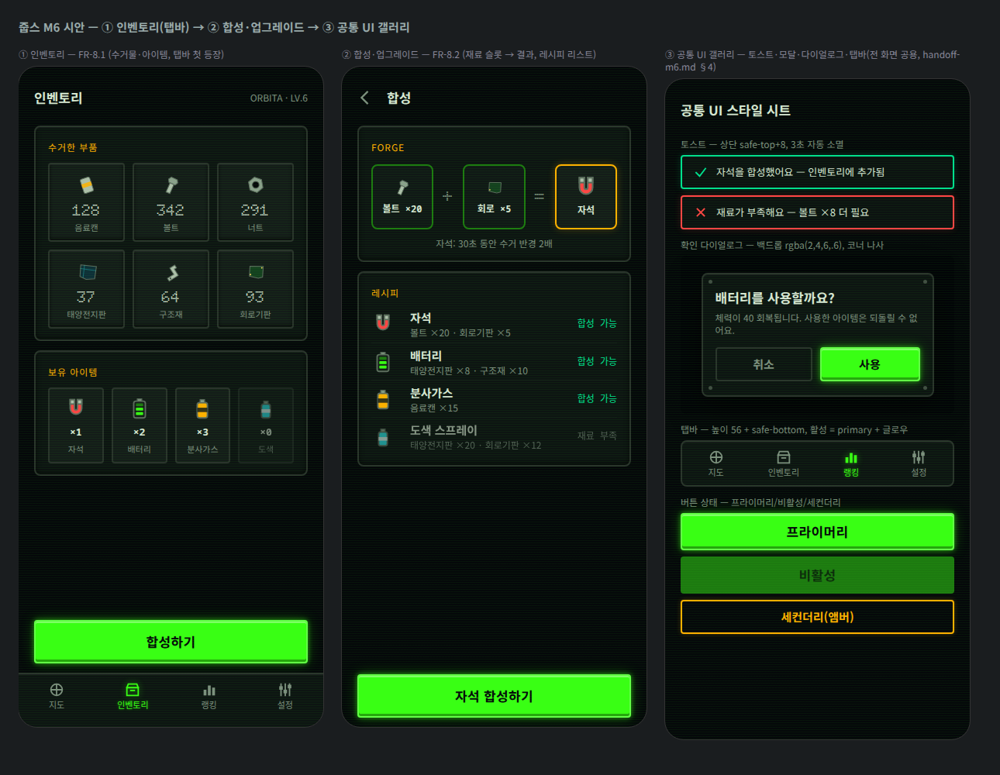

# M6 개발 핸드오프 가이드 — 인벤토리·합성 + 공통 UI

> [토큰 v1.0](./design-tokens.md) · M1~M5 핸드오프 위에, M6([EPIC 8](../product/requirements.md), FR-8.1~8.2)과 **전 화면 공통 UI**(토스트·모달·다이얼로그·탭바 — 인벤토리 D 섹션 완결)의 스펙을 담습니다.
> **완성 시안**: [mockups/inventory-common-ui.html](./mockups/inventory-common-ui.html) · [스크린샷](./mockups/inventory-common-ui.png)

## 1. 아이템 아이콘 (신규 에셋)

| 파일 | 아이템 | 효과(초안) |
|---|---|---|
| `public/ui/item-magnet.svg` | 자석 | 30초 동안 수거 반경 2배 |
| `public/ui/item-battery.svg` | 배터리 | 체력 회복 |
| `public/ui/item-fuel.svg` | 분사가스 캔 | 아케이드 연료 충전 |
| `public/ui/item-spray.svg` | 도색 스프레이 | 줍스 꾸미기(색·데칼) |
| `public/ui/item-wrench.svg` | 렌치 | 업그레이드 소재 |

- **32 그리드 · 고유색**(currentColor 아님 — 아이템은 색이 정체성). 외곽선 `#5c6b5e` 2px로 쓰레기 스프라이트와 동일 문법.
- 탭바용 아이콘 3종 추가: `icon-map.svg` · `icon-inventory.svg` · `icon-ranking.svg`(24 그리드 currentColor, 기존 세트와 통일) — 설정은 기존 `icon-settings.svg`.

## 2. 인벤토리 화면 (FR-8.1)

- 상단 바: 제목 + 우측 `{이름} · LV.{n}` caption.
- **수거한 부품 그리드**: 3열, 셀 = surface-raised + 베젤, 아이콘 34px(debris 지오메트리 재사용) + 수량(display 20) + 이름(caption). 수량은 `debris-sheet.meta.json`의 `types` 순서.
- **보유 아이템 행**: 4열, 아이콘 30px + `×수량`(mono 13) + 이름(caption). 수량 0은 셀 전체 불투명도 .55.
- CTA `합성하기` → 합성 화면.
- **탭바 첫 등장**(공통 스펙 §4-3): 지도 · 인벤토리 · 랭킹 · 설정. M6 이후 주요 화면(지도·인벤토리·랭킹·설정)에 상시 노출, 게임 장면(아케이드·미니게임·발사)에서는 숨김.

## 3. 합성 화면 (FR-8.2)

- **Forge 패널**: 재료 슬롯 2(84×84, 점선 베젤 → 채움 시 실선 `--color-primary-dim`) + `+`/`=`(display 24 muted) + **결과 슬롯**(앰버 보더 + 글로우 — 결과물 강조). 아래 효과 설명 caption 중앙.
- **레시피 리스트**: 행 그리드 `40px | 1fr | auto`(아이콘 | 이름+재료 | 상태), 행 높이 ≥ 48. 상태: `합성 가능`(mono 12 success) / `재료 부족`(muted, 행 불투명도 .6).
- 레시피 탭 시 Forge 슬롯 자동 채움 → CTA 라벨이 `{아이템} 합성하기`로 변경.
- 합성 실행: CTA → 확인 없이 즉시(재료 소모는 확인 다이얼로그 불필요 — 되돌릴 수 없는 **아이템 사용**만 다이얼로그, §4-2). 완료 토스트(§4-1) + 결과 슬롯 200ms 글로우 펄스(reduced-motion: 정지).
- 레시피 수치(볼트 ×20 등)는 시안 더미 — 밸런스는 게임 설정(`joop_03_game_config`) 소관.

## 4. 공통 UI (인벤토리 D 완결)

### 4-1. 토스트
- 위치 **상단 `safe-top + 8px`**, 좌우 `--page-pad-x`, 최대 1개(신규가 기존 대체).
- 스타일: `rgba(13,20,18,.92)` + 2px 보더(성공 `--color-success` / 오류 `--color-danger` / 정보 `--color-neutral-700`) + 같은 색 외곽 글로우, radius 4, 아이콘 18px(체크/X) + 본문 13/18.
- 등장 slide-down 200ms `--ease-console`, **3초 후 자동 소멸**(오류는 5초). reduced-motion: 페이드 없이 즉시 표시/제거.

### 4-2. 모달·확인 다이얼로그
- 백드롭 `rgba(2, 4, 6, .6)`(탭 시 닫힘 = 취소), 컨테이너 max-width 300, surface + 2px 베젤 + `0 12px 40px rgba(0,0,0,.6)`, radius 8, **코너 나사 도트 4개**(5px — 카세트퓨처리즘 시그니처, 보급 카트리지와 동일).
- 제목 17/24 600 + 본문 caption + 버튼 행(취소 = 보더 muted 세컨더리 flex 1 / 실행 = 프라이머리 flex 1.4, min-height 44).
- 용도: **되돌릴 수 없는 액션만**(아이템 사용, 청약 변경, 초기화). 합성·수거 등 재화 획득은 토스트로 충분.

### 4-3. 탭바
- 높이 **56 + safe-bottom**, 상단 2px `--color-neutral-700` 보더 + 인셋 하이라이트, surface 배경.
- 탭 4개(각 flex 1, 터치 전체): 아이콘 22px + 라벨 11/14. 비활성 `--color-muted` / **활성 `--color-primary` + 텍스트 글로우 + 아이콘 drop-shadow**.
- 노출 규칙: 지도·인벤토리·랭킹·설정 화면에서 상시. 게임 장면·온보딩·발사 시퀀스에서는 숨김(몰입 우선).
- 첫 화면(M1, 미로그인 랜딩)은 탭바 없음 유지 — 로그인 후 지도 화면이 홈이 되며 탭바 등장.

#### 미출시 탭(비활성) 상태 — 해당 화면이 아직 출시되지 않은 탭

카세트퓨처리즘에서 꺼진 계기는 **"저휘도로 존재하되 발광하지 않는"** 상태다. 완전히 지우면 콘솔이 비어 보이고, 무반응이면 "고장"으로 읽힌다 — 관제 콘솔은 죽은 버튼에도 응답한다.

| 속성 | 값 | 비고 |
|---|---|---|
| 아이콘·라벨 색 | `--color-muted` `#7d8f7f` | 일반 비활성 탭과 동일 색. `--color-primary-dim`은 "곧 켜질 인광" 뉘앙스라 탭 가능해 보임 — 사용 금지 |
| 탭 전체 불투명도 | **0.55** | 수량 0 아이템 셀(§2)의 `.55`와 동일 문법. `.40`은 surface 위 대비 약 2:1로 판독 불가 수준 |
| 라벨 | 원래 라벨 유지("인벤토리"·"랭킹") | "준비 중" 캡션 병기 **안 함** — 높이 56에 3단 구성은 과밀. 상태 안내는 탭 시 토스트가 담당 |
| 탭 시 반응 | **정보 토스트 "준비 중이에요"**(§4-1 정보 스타일 `--color-neutral-700` 보더, 3초) | 무반응 금지. 눌림 효과(translateY)는 주지 않음 |
| 글로우·하이라이트 | 없음 | 활성 글로우·인셋 하이라이트 모두 제거 |
| 접근성 | `aria-disabled="true"` + 포커스 가능 유지, `aria-label="{라벨} (준비 중)"` | `title` 툴팁은 모바일에서 무의미 — 불필요 |

i18n: `tab.comingSoon` = "준비 중이에요" (§5 표 참고).

#### 인터림 내비 규칙 (M4 우주 지도 출시 이전)

- **로그인 사용자의 홈 = 궤도 대시보드**(`/{lang}`)이며, 이 화면에서 탭바를 노출한다. **지도 탭 = 홈**(활성 상태).
- M4 출시 시 지도 화면이 홈을 승계하고 궤도 대시보드 정보는 지도 화면으로 흡수 — **탭 4개 구조·순서는 불변**, 지도 탭의 목적지만 바뀐다.
- 설정 탭 → 미니 설정 화면(언어·버전) 연결 인정. 인벤토리(M6 구현 전)·랭킹(M7 이전) 탭은 위의 미출시 탭 상태를 적용.
- 미로그인 랜딩은 탭바 없음 유지(기존 규칙 그대로).

### 4-4. 버튼 상태(총정리)
- 프라이머리 / 프라이머리-비활성(`--color-primary-dim` 배경, 글로우 제거) / 세컨더리(앰버 아웃라인) — 시안 ③ 하단이 3종 비교 레퍼런스. 상세 값은 [M1 §5-5](./handoff-m1.md)·[M2 §3-4](./handoff-m2.md).

## 5. i18n 키 초안

| 키 | 한국어 기본 |
|---|---|
| `inventory.title` | 인벤토리 |
| `inventory.parts` | 수거한 부품 |
| `inventory.items` | 보유 아이템 |
| `inventory.forge` | 합성하기 |
| `forge.title` | 합성 |
| `forge.recipes` | 레시피 |
| `forge.canCraft` | 합성 가능 |
| `forge.missing` | 재료 부족 |
| `forge.craft` | {item} 합성하기 |
| `forge.done` | {item}을(를) 합성했어요 — 인벤토리에 추가됨 |
| `forge.error.missing` | 재료가 부족해요 — {mat} ×{n} 더 필요 |
| `item.use.title` | {item}을(를) 사용할까요? |
| `item.use.confirm` | 사용 |
| `common.cancel` | 취소 |
| `tab.map` / `tab.inventory` / `tab.ranking` / `tab.settings` | 지도 / 인벤토리 / 랭킹 / 설정 |
| `tab.comingSoon` | 준비 중이에요 |

## 6. 검수 체크리스트

- [x] 아이템 아이콘 5종(32 그리드·고유색) + 탭 아이콘 3종(24 그리드·currentColor) — 기존 세트와 스타일 통일
- [x] 수거물 아이콘 = debris 지오메트리 재사용(게임↔인벤토리 일관성)
- [x] 공통 UI 4종(토스트·다이얼로그·탭바·버튼 상태) 규칙화 — D 섹션 완결
- [x] 다이얼로그는 되돌릴 수 없는 액션 전용, 토스트 자동 소멸·reduced-motion 대안
- [x] 탭바 노출 규칙(게임 장면 숨김·첫 화면 없음) 정의
- [x] 용량: 신규 SVG 8종 ~6KB, 시안 스크린샷 ~180KB
